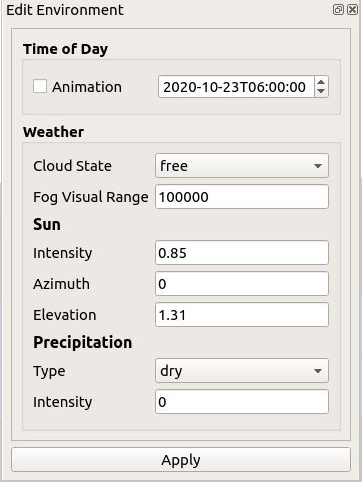
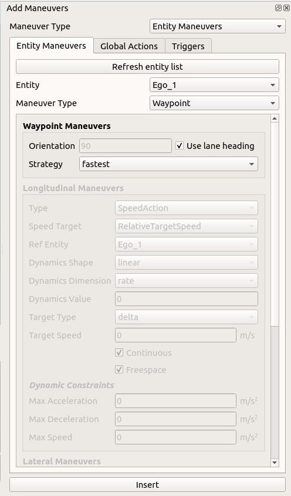

# QGIS OpenSCENARIO Generation Plugin

### Prerequisites
- Python 3.6
- [QGIS 3](https://www.qgis.org/)
- [Carla AD Map plugin with Python bindings](https://github.com/carla-simulator/map)
- [defusedxml package](https://pypi.org/project/defusedxml/)

## Installation
1. Clone Scenario Runner
2. Create a symlink folder at `~/.local/share/QGIS/QGIS3/profiles/default/python/plugins` to `OSCGenerator/OSC_Generator`
  ```bash
  ln -s /path/to/srunner/OSCGenerator/OSC_Generator ~/.local/share/QGIS/QGIS3/profiles/default/python/plugins
  ```
3. Run QGIS 3
4. Enable plugin from plugins menu (`Plugins > Manage and Install Plugins`)
5. Enjoy!
   
## Features
- Place entiites onto loaded OpenDRIVE map (through AD Map plugin)
- Add maneuvers to entities
  - Current support for waypoints only
- Set initial environment variables (cloud state, time of day, precipitation)

## Support List

✅ - Supported

❌ - Not supported

### Environment
Description | Support | Notes
-- | -- | --
Time of day | ✅ | Includes enabling animation of time
Cloud state | ✅ | 
Fog visual range | ✅ | 
Sun | ✅ | Includes intensity, azimuth, elevation
Precipitation | ✅ | Includes precipitation type and intensity

### Actors
Description | Support | Notes
-- | -- | --
Spawn with World Position | ✅ | 
Set initial speed | ✅ | 
Set orientation | ✅ | Can either use lane heading, or manually specified
Set as ego vehicle | ✅ | Only for vehicles
Agent selection | ✅ | Only for ego vehicles (manual_control will require manually changing `Ego_1` tag to `hero`)
Agent parameter overrides | ❌ | Only for ego vehicles (overriding throttle, brake, clutch, parking brake, steering, gear)

### Static Objects (Props)
Description | Support | Notes
-- | -- | --
Spawn with World Position | ✅ | 
Set object type | ✅ | 
Set object mass | ✅ | 
Set orientation | ✅ | Can either use lane heading, or manually specified
Enable/Disable physics | ✅ | 

### End Evaluation KPIs
Description | Support | Notes
-- | -- | --
Running stop test | ✅ | 
Running red light test | ✅ | 
Wrong lane test | ✅ | 
On sidewalk test | ✅ | 
Keep lane test | ✅ | 
Collision test | ✅ | 
Driven distance test | ✅ | 

### Entity Maneuvers
Description | Support | Notes
-- | -- | --
Waypoints | ✅ | 
Longitudinal | ❌ | 
Lateral | ❌ | 
Synchronize Action | ❌ | 
Teleport Action | ❌ | 

### Global Maneuvers
Description | Support | Notes
-- | -- | --
Environment | ❌ | 
Infrastructure Action | ✅ | Traffic light signal control


## Guide
### Prerequisite
1. Open OpenDRIVE map using CARLA AD Map plugin

### Toolbar UI


Icon | Description
-- | --
 | Edit environment
 | Add vehicles
 | Add pedestrians
 | Add maneuvers
 | Add end evaluation KPIs (Specific for Scenario Runner)
 | Export OpenSCENARIO file

### Adding Environment Variables
1. Click on 'Edit environment' button to load dock widget.
2. Edit parameters in dock widget to desired parameters.
   
  

3. Press on 'Apply'

_Note: To change environment settings, simply adjust the parameters and press 'Apply' again. Previous environment settings will be cleared and replaced with the updated ones._

### Adding Vehicles
1. Click on 'Add vehicles' button to load dock widget.
2. Choose parameters (vehicle type, use lane heading / manually specify, initial speed)
3. Agent selection is only enabled for Ego vehicles.
   
  

4. Press on 'Insert', mouse pointer will change to cross-type pointer.
5. Click on desired map position to spawn vehicle.
6. If click point contains multiple lanes and 'Use lane heading' is checked, a dialog box will appear and ask to select lane ID to use for lane heading.
   
   

_Note: Currently you can insert vehicle one at a time._

_Note: You can toggle labels on and off by clicking on the 'Label' button_

### Adding Pedestrians
1. Click on 'Add pedestrians' button to load dock widget.
2. Choose parameters (pedestrian type, use lane heading / manually specify, initial speed)
3. If 'Use random pedestrian' is checked, a random pedestrian type will be selected for every spawned pedestrian.
   
   

4. Press on 'Insert', mouse pointer will change to cross-type pointer.
5. Click on desired map position to spawn pedestrian.
6. If click point contains multiple lanes and 'Use lane heading' is enabled, a dialog box will appear and ask to select lane ID to use for lane heading.
   
   
  
_Note: You can insert as many pedestrians as you desire after pressing on 'Insert'_

_Note: You can toggle labels on and off by clicking on the 'Label' button_

### Removing Vehicles or Pedestrians
1. In `Layers` right click on layer and select `Open Attribute Table`.
   
  

2. Click on the pencil icon on top left to enable editing.
3. Highlight the row containing the entity for deletion.
4. Click on trash can to delete entity.
5. Click on pencil icon to disable editing.
6. When prompted to save changes, choose 'Yes'.

### Adding Maneuvers
1. Click on 'Add Maneuvers' button to load dock widget.
   
   

2. Choose either to add entity maneuvers or global actions under `Maneuver Type`.
3. Entity maneuvers
   1. Choose entity to apply maneuver to, if entity is not listed, click on `Refresh entity list`.
   2. Set up the start triggers of the maneuvers using the `Triggers` tab.
   3. Click on `Insert`, and click on the map to spawn as many waypoints as intended.
   4. To end spawning of waypoints, click on the `Pan Map` tool (symbolized with a hand icon)
4. Global actions
   1. To enable/disable labels on traffic lights, press on `Toggle traffic light labels`.
   2. To refresh traffic light IDs, press on `Refresh traffic light IDs`.
   3. Choose the desired action.
   4. Set up the start triggers of the maneuvers using the `Triggers` tab.
   5. Click on `Insert`.

_Note: It is important to set up the start triggers first before inserting the maneuver_
1. Special note for Reach Position Condition
   1. To set up `ReachPositionCondition`, click on `Choose position`.
   2. Click on a point on the map.
   3. The coordinates of the click point will be updated in the UI.
